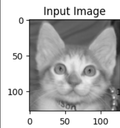

# Autoencoder Image Reconstruction

## Dataset
Dataset yang digunakan adalah dataset gambar kategori **Cats vs Dogs**. Dataset ini berisi gambar hewan kucing dan anjing yang digunakan untuk melatih model autoencoder.

## Arsitektur Autoencoder
Model autoencoder ini menggunakan arsitektur **Convolutional Neural Networks (CNN)** pada encoder dan decoder untuk melakukan kompresi dan rekonstruksi gambar. Model ini bertujuan untuk mengurangi dimensi gambar input dan kemudian memulihkannya.

## Hasil dan Performa
Pada pelatihan, model berhasil menurunkan nilai **loss** secara signifikan. Berikut adalah hasil rekonstruksi dari gambar input.

### Input Image

### Output Image (Reconstructed)

### Target Image

## Performa
Loss function yang digunakan adalah **Mean Squared Error (MSE)**, dan model menunjukkan penurunan loss yang stabil selama pelatihan.

### Loss Graph

